# 🛡️ Sentinela AI: Real-Time Network Forensics Engine


-lightgrey)


## 📌 Overview
**Sentinela** is a lightweight, AI-powered Network Intrusion Detection System (NIDS) designed for real-time traffic analysis. 

Built during a 48-hour intensive engineering sprint, this engine bridges low-level packet capture with high-level machine learning. It captures live network traffic, extracts flow-based features (inspired by the **CIC-IDS2017** dataset standards), and classifies packets instantly using a **Random Forest Classifier**.

## Key Features
* **Live Packet Sniffing:** Utilizes `Scapy` for raw socket interaction and real-time data acquisition.
* **AI-Powered Detection:** Implements a `Random Forest` model trained on synthetic attack signatures (DoS patterns, Port Scanning).
* **Rich Terminal UI:** Features a professional, live-updating dashboard using the `Rich` library.
* **Apple Silicon Optimization:** Tuned for performance on macOS ARM64 architecture (M4 Pro).
* **Modular Architecture:** strictly separates Model Training (`engine.py`) from Real-Time Inference (`watcher.py`).

## Tech Stack
* **Language:** Python 3
* **Networking:** `Scapy` (Packet manipulation & capture)
* **Machine Learning:** `Scikit-Learn` (Random Forest Classifier), `Pandas` (Dataframing), `Joblib` (Model Serialization)
* **Visualization:** `Rich` (Terminal Dashboard)

## Project Structure
```bash
Sentinela_Engine/
├── engine.py           # The "Brain": Generates synthetic data & trains the ML model
├── watcher.py          # The "Eye": Captures live traffic & runs inference
├── sentinela_model.pkl # The serialized AI model (Auto-generated)
└── README.md           # Documentation
```
## System Architecture

```mermaid
graph TD
    subgraph Stage 1: Intelligence Engine Offline
        A[Synthetic Threat Data<br>CIC-IDS2017 Logic] -->|Pandas DataFrame| B(RandomForest Classifier)
        B -->|joblib.dump| C[(sentinela_model.pkl)]
    end

    subgraph Stage 2: Live Forensics Pipeline
        D[Host Network Interface] -->|Scapy Sniff<br>Promiscuous Mode| E[Packet Capture]
        E -->|Async Callback| F[Feature Extractor]
        F -->|Length, Protocol, Port| G{AI Inference Engine}
        C -.->|joblib.load| G
        G -->|Prediction| H[Rich Terminal Dashboard]
        
        H -->|Verdict == 0| I[✅ NORMAL]
        H -->|Verdict == 1| J[⚠️ ATTACK]
        
        style I fill:#2ea043,color:white,stroke:none
        style J fill:#da3633,color:white,stroke:none
        style C fill:#1f6feb,color:white,stroke:none
    end
```

## Installation & Execution
### Clone the repository:
```bash
git clone [https://github.com/alfayezahmad/Sentinela-AI-NIDS.git](https://github.com/alfayezahmad/Sentinela-AI-NIDS.git)
cd Sentinela-AI-NIDS
```
### Create and activate the isolated virtual environment:
```bash
python3 -m venv .venv
source .venv/bin/activate
```
### Install Dependencies:
```bash
pip install scapy pandas scikit-learn joblib rich
```
### Phase 1: Train the AI Brain
```bash
python engine.py
```
Output: [+] Brain successfully exported to 'sentinela_model.pkl'
### Phase 2: Launch the Live Forensics Dashboard
(Requires sudo to access the network interface in promiscuous mode)
```bash
sudo .venv/bin/python watcher.py
```

## Disclaimer
This tool is for educational purposes and local network defense only. Packet capturing on networks you do not own or have permission to audit is illegal.

Built by Alfayez Ahmad as a specialized research project in Network Security & AI.
