# Sentinela AI: Real-Time Network Forensics Engine


## 📌 Overview
**Sentinela** is a lightweight, AI-powered Network Intrusion Detection System (NIDS) designed for real-time traffic analysis. 

Built during an intensive engineering sprint, this engine bridges low-level packet capture with high-level machine learning. It captures live network traffic, extracts flow-based features (inspired by the **CIC-IDS2017** dataset standards), and classifies packets instantly using a **Random Forest Classifier**.

## Key Features
* **Live Packet Sniffing:** Utilizes `Scapy` for raw socket interaction and real-time data acquisition.
* **AI-Powered Detection:** Implements a `Random Forest` model trained on synthetic attack signatures (DoS patterns, Port Scanning).
* **Rich Terminal UI:** Features a professional, live-updating dashboard using the `Rich` library.
* **Apple Silicon Optimization:** Tuned for performance on macOS ARM64 architecture (M4 Pro).
* **Modular Architecture:** Strictly separates Model Training (`engine.py`) from Real-Time Inference (`watcher.py`).

## Tech Stack
* **Language:** Python 3.10
* **Networking:** `Scapy` (Packet manipulation & capture)
* **Machine Learning:** `Scikit-Learn` (Random Forest), `Pandas` (Dataframing), `Joblib` (Serialization)
* **Visualization:** `Rich` (Terminal Dashboard)

## Project Structure
```text
Sentinela_Engine/
├── engine.py           # The "Brain": Generates synthetic data & trains the ML model
├── watcher.py          # The "Eye": Captures live traffic & runs inference
├── Dockerfile          # Cloud-native containerization configuration
├── requirements.txt    # Strict dependency pinning
└── README.md           # Documentation
```
## System Architecture

```mermaid
graph TD
    subgraph Stage 1: Intelligence Engine Offline
        A[Synthetic Threat Data<br>CIC-IDS2017 Logic] -->|Pandas DataFrame| B(RandomForest Classifier)
        B -->|joblib.dump| C[(sentinela_model.pkl)]
    end

    subgraph Stage 2: Live Forensics Pipeline
        D[Host Network Interface] -->|Scapy Sniff<br>Promiscuous Mode| E[Packet Capture]
        E -->|Async Callback| F[Feature Extractor]
        F -->|Length, Protocol, Port| G{AI Inference Engine}
        C -.->|joblib.load| G
        G -->|Prediction| H[Rich Terminal Dashboard]
        
        H -->|Verdict == 0| I[✅ NORMAL]
        H -->|Verdict == 1| J[⚠️ ATTACK]
        
        style I fill:#2ea043,color:white,stroke:none
        style J fill:#da3633,color:white,stroke:none
        style C fill:#1f6feb,color:white,stroke:none
    end
```

## Mathematical Foundation: Feature Evaluation
The core of the detection engine relies on a Random Forest ensemble. The model evaluates the quality of network flow features (Packet Size, Protocol, Destination Port) using **Gini Impurity** to determine optimal decision node splits:

$$Gini(p) = 1 - \sum_{i=1}^{J} p_i^2$$

Where $p_i$ is the probability of a packet belonging to class $i$ (Normal vs. Attack). 

For real-time inference, Sentinela aggregates the predictions from the ensemble of $N$ decision trees using majority voting to output a highly confident classification, minimizing false positives:

$$\hat{y} = \text{mode}\{h_1(x), h_2(x), ..., h_N(x)\}$$

## Containerized Deployment (Cloud-Native)
Running a packet sniffer inside an isolated container requires bypassing standard Docker network restrictions by passing host network capabilities to the runtime.
```bash
# 1. Build the image
docker build -t sentinela-nids .

# 2. Train the model inside the container
docker run --name sentinela-brain sentinela-nids python engine.py

# 3. Commit the trained model state to a new image layer
docker commit sentinela-brain sentinela-nids-trained

# 4. Run the live sniffer using host networking and RAW capabilities
docker run -it --rm \
  --network host \
  --cap-add=NET_ADMIN \
  --cap-add=NET_RAW \
  sentinela-nids-trained python watcher.py
```
## Local Development (Virtual Environment)
```bash
git clone [https://github.com/alfayezahmad/Sentinela-AI-NIDS.git](https://github.com/alfayezahmad/Sentinela-AI-NIDS.git)
cd Sentinela-AI-NIDS

# Setup environment
python3 -m venv .venv
source .venv/bin/activate
pip install -r requirements.txt

# Phase 1: Train the AI Brain
python engine.py

# Phase 2: Launch the Live Forensics Dashboard
sudo .venv/bin/python watcher.py
```
## 🗺️ Roadmap & Future Work
Currently, Sentinela operates as a host-level NIDS. Future iterations aim to transform this into a distributed, cloud-native security tool:
- [ ] **Kubernetes DaemonSet Deployment:** Architect deployment manifests to run Sentinela on every node within a K8s cluster for cluster-wide threat monitoring.
- [ ] **eBPF Integration:** Migrate from user-space `Scapy` sniffing to kernel-space **eBPF** (Extended Berkeley Packet Filter) to handle high-throughput enterprise traffic without CPU bottlenecks.
- [ ] **Prometheus Metrics:** Expose a `/metrics` endpoint to log threat detection rates, enabling real-time alerting via Grafana dashboards.

## Disclaimer
This tool is for educational purposes and local network defense only. Packet capturing on networks you do not own or have permission to audit is illegal.

Built by Alfayez Ahmad as a specialized research project in Network Security & AI | Copyright: © 2026
